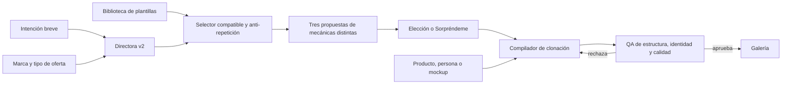

# Motor de estáticos v2: Clone-First

## Decisión

Cada generación parte de una sola plantilla visual concreta y una sola identidad de marca. Las reglas extensas dejan de formar parte del prompt de imagen: se aplican al seleccionar la plantilla y al auditar el resultado.

La imagen generada es la pieza final. El servidor no añade tarjetas, botones, logos ni otros módulos visuales de forma automática. El compositor tipográfico permanece disponible únicamente para usos explícitos.

## Flujo

## Límites de componentes

1. Biblioteca maestra
   - Guarda imágenes y etiquetas estructurales, no prompts de marca.
   - Las plantillas globales son administradas por el fundador.
   - Una inspiración de usuaria es privada para su marca.

2. Selector
   - Filtra primero por tipo de oferta y formato.
   - Prefiere etapa compatible.
   - Excluye las últimas cinco plantillas usadas por la marca.
   - Devuelve mecánicas distintas para propuestas hermanas.

3. Directora
   - Clasifica la intención y produce copy breve y sustituciones concretas.
   - Puede formular una sola pregunta únicamente si falta un dato que impide generar.
   - No contiene doctrina visual extensa.

4. Compilador
   - Recibe exactamente una plantilla y, cuando existe, una fuente de identidad.
   - Produce un prompt de máximo veinte líneas.
   - No mezcla referencias ni adjunta activos sin rol.

5. QA
   - Evalúa la imagen final.
   - Comprueba fidelidad estructural, sustitución completa de identidad, legibilidad, artefactos y adecuación al tipo de oferta.
   - La presencia de identidad ajena bloquea el resultado.

## Héroe por tipo de oferta

| Tipo | Héroe predeterminado | Fuente de verdad |
| --- | --- | --- |
| Física | Producto real | Foto elegida del producto |
| Infoproducto | Programa en dispositivo | Portada o mockup generado |
| Servicio | Persona o resultado | Banco Mi imagen o evidencia aportada |
| Marca personal | Persona y prueba social | Banco Mi imagen y datos de marca |

## Compatibilidad y migración

- Créditos, reembolsos, galería, descarga y endpoint de edición conservan sus contratos.
- Los arquetipos existentes se reutilizan como etiquetas de mecánica.
- Las referencias existentes pueden sembrar la biblioteca sin duplicar archivos.
- Las piezas antiguas conservan sus metadatos; las nuevas registran `template_id`, mecánica y evaluación estructural.

## Riesgos y mitigaciones

- Biblioteca pequeña: permitir inspiración directa y caída controlada a referencias existentes.
- Plantilla con marca visible: QA bloqueante de identidad y regeneración.
- Infoproducto sin portada: generar un mockup neutro dedicado antes de clonar.
- Poca variedad: exclusión persistente y mecánica distinta por lote.
- Texto incorrecto: copy corto, QA final y una regeneración dirigida; nunca tapar la pieza con una tarjeta automática.

## Criterios de operación

- Ningún prompt final supera veinte líneas.
- Ninguna generación mezcla más de una plantilla.
- Ninguna propuesta consecutiva repite plantilla dentro de las últimas cinco de la marca.
- Una marca sin producto físico nunca recibe un héroe de packaging.
- Un resultado con identidad ajena no se guarda como aprobado.
